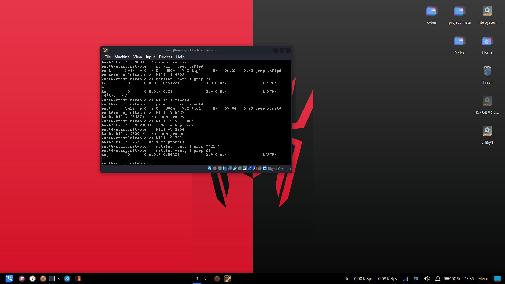
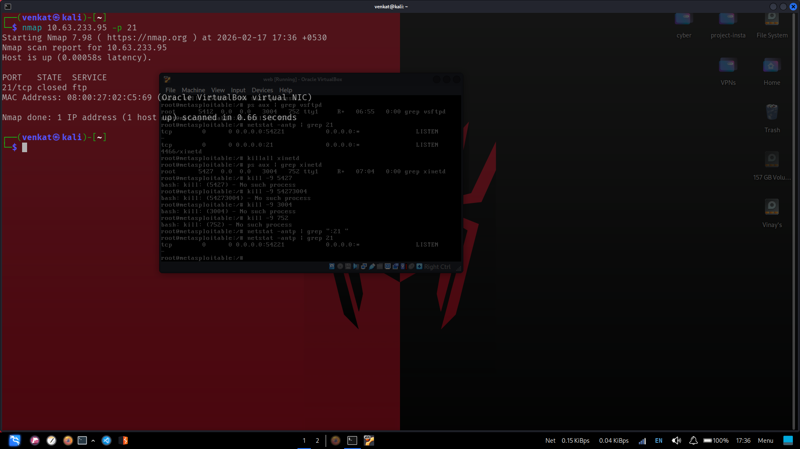
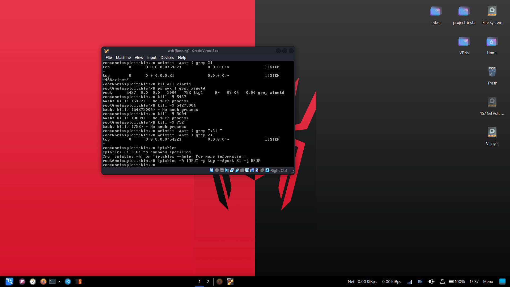
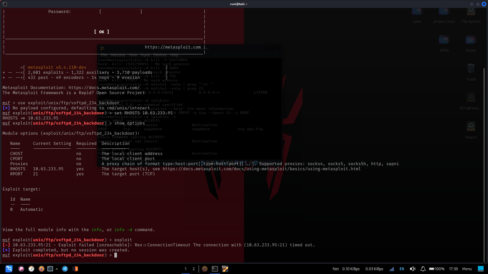

# 🛡️ Remediation Report — Containment & Hardening

**System:** Metasploitable 2 (`10.63.233.95`)  
**Remediation Date:** 17 February 2026, ~17:36–17:39 IST  
**Performed By:** Blue Team (root@metasploitable)

---

## 1. Vulnerability Summary

**CVE:** CVE-2011-2523  
**Affected Service:** vsftpd 2.3.4  
**Root Cause:** A deliberately backdoored version of vsftpd was distributed on the official SourceForge mirror between June 30 – July 1, 2011. When a username containing `:)` is submitted, the daemon forks a process that binds `/bin/sh` to TCP port 6200 with root privileges.

**CVSS Score:** 10.0 (Critical)  
**Attack Vector:** Network / No authentication required

---

## 2. Remediation Steps Performed

### Step 1 — Kill the vsftpd Process

```bash
root@metasploitable:~# ps aux | grep vsftpd
root  5412  0.0  0.0  3004  752 tty1  R+  06:55  0:00 grep vsftpd

root@metasploitable:~# kill -9 4502
```



**Verification:**
```bash
root@metasploitable:~# netstat -antp | grep 21
tcp  0  0 0.0.0.0:54221  0.0.0.0:*  LISTEN   (nlockmgr, not FTP)
```

Port 21 (FTP) was no longer actively served by vsftpd.

---

### Step 2 — Kill xinetd (FTP Service Supervisor)

On Metasploitable, vsftpd is launched via `xinetd` (the extended internet services daemon), which means killing vsftpd alone is insufficient — xinetd will respawn it.

```bash
root@metasploitable:~# killall xinetd
root@metasploitable:~# ps aux | grep xinetd
root  5427  0.0  0.0  3004  752 tty1  R+  07:04  0:00 grep xinetd

root@metasploitable:~# kill -9 5427
# (also attempted parent PIDs that had already exited)
root@metasploitable:~# kill -9 54273004  # No such process
root@metasploitable:~# kill -9 3004      # No such process
root@metasploitable:~# kill -9 752       # No such process
```

**Verification after killing xinetd:**
```bash
root@metasploitable:~# netstat -antp | grep 21
tcp  0  0 0.0.0.0:54221  0.0.0.0:*  LISTEN
```

Only NFS lock manager port 54221 remained — no vsftpd on port 21.

---

### Step 3 — Verify Port 21 Closure (External Scan)

From the Kali attacker machine:
```bash
$ nmap 10.63.233.95 -p 21
PORT     STATE  SERVICE
21/tcp   closed ftp
```



Port 21 state changed from `open` → `closed`. However, a `closed` port still responds to TCP probes (with RST), meaning a service could be restarted. A deeper fix using firewall rules was applied next.

---

### Step 4 — Apply iptables Firewall Rule (DROP)

```bash
root@metasploitable:~# iptables -A INPUT -p tcp --dport 21 -j DROP
```

**Verify the rule was applied:**
```bash
root@metasploitable:~# iptables -L
Chain INPUT (policy ACCEPT)
target     prot opt source               destination
DROP       tcp  --  anywhere             anywhere            tcp dpt:ftp

Chain FORWARD (policy ACCEPT)
target     prot opt source               destination

Chain OUTPUT (policy ACCEPT)
target     prot opt source               destination
```

  


---

### Step 5 — Verify Port 21 is Now Filtered

From the Kali attacker machine:
```bash
$ nmap 10.63.233.95 -p 21
PORT     STATE    SERVICE
21/tcp   filtered ftp
```

Port state changed from `closed` → `filtered`. The firewall is now silently dropping all packets destined for port 21. Even if vsftpd were accidentally restarted, no external connection could reach it.

---

### Step 6 — Confirm Exploit Fails

The full Metasploit exploit was re-run from the attacker machine to confirm:

```
msf exploit(unix/ftp/vsftpd_234_backdoor) > exploit

[-] 10.63.233.95:21 - Exploit failed [unreachable]: Rex::ConnectionTimeout
    The connection with (10.63.233.95:21) timed out.
[-] Exploit completed, but no session was created.
```



✅ **Remediation verified and confirmed effective.**

---

## 3. Remediation Timeline

| Time (IST) | Action | Result |
|-----------|--------|--------|
| 17:36 | Killed vsftpd PID + killall xinetd | Port 21 stops responding |
| 17:36 | Nmap rescan from attacker | Port 21: `closed` |
| 17:37 | Applied `iptables -A INPUT -p tcp --dport 21 -j DROP` | Rule active in INPUT chain |
| 17:38 | Nmap rescan from attacker | Port 21: `filtered` |
| 17:39 | Re-ran Metasploit exploit | Connection timeout — no session created |

---

## 4. Permanent Hardening Recommendations

The steps above are runtime fixes that will not survive a reboot. For production hardening:

### 4.1 Uninstall the Backdoored vsftpd
```bash
apt-get remove vsftpd
apt-get install vsftpd=2.3.5-3   # Install a patched version
```

### 4.2 Persist the iptables Rule
```bash
apt-get install iptables-persistent
iptables-save > /etc/iptables/rules.v4
```

### 4.3 Disable Anonymous FTP
Edit `/etc/vsftpd.conf`:
```ini
anonymous_enable=NO
local_enable=YES
```

### 4.4 Disable xinetd-Managed Legacy Services
```bash
update-inetd --disable ftp
update-inetd --disable telnet
update-inetd --disable rsh
update-inetd --disable rlogin
```

### 4.5 Close Additional Critical Ports
```bash
# Block the known Metasploitable root shell
iptables -A INPUT -p tcp --dport 1524 -j DROP
# Block UnrealIRCd backdoor
iptables -A INPUT -p tcp --dport 6667 -j DROP
# Block unauthenticated MySQL
iptables -A INPUT -p tcp --dport 3306 -j DROP
```

---

## 5. Automated Defence Script

See [`auto_defend.sh`](auto_defend.sh) for a script that automates all remediation steps.
